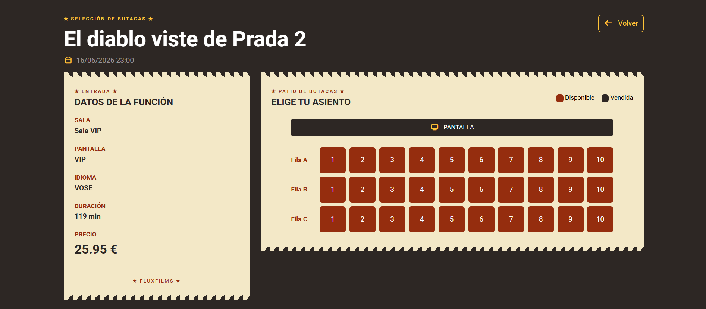

# 🎬 Gestión de Cine

> Aplicación web para **gestionar películas, salas, funciones, reservas y venta de entradas** — construida con Spring Boot, renderizado en servidor con Thymeleaf y Bootstrap.

<p align="center">
  
  
  
  
  
  
</p>

---

## ¿Qué es?

**Gestión de Cine** es una aplicación web completa (no una API JSON, sino HTML renderizado en servidor) donde:

- **Cualquier visitante** puede consultar la cartelera, explorar películas, ver horarios disponibles y leer reseñas.
- **Usuarios registrados** pueden reservar asientos, comprar entradas, escribir reseñas y marcar favoritos.
- **Administradores** gestionan películas, salas, funciones, reseñas, y usuarios desde el panel de administración.

Todo con autenticación real, control de acceso por roles, subida de imágenes y datos de demostración listos para usar.

---

## Funcionalidades principales

### 🎥 Cartelera y películas

- Listado de películas con **filtros** por género, estado, edad mínima y título.
- Ficha completa de cada **película** con sinopsis, duración, director, puntuaciones, tráiler y **reseñas**.
- Consulta de funciones disponibles por fecha, hora y sala.
- Solo se muestran películas activas en cartelera.

### 🏢 Gestión de salas

- Administración de salas de cine.
- Configuración de **capacidad y distribución de asientos**.
- Gestión de salas estándar, 3D, IMAX, SCREEN_X, DOLBY_CINE y VIP.

### 🎟️ Reservas y venta de entradas

- Reserva de asientos desde el **mapa de la sala**.
- - Suma de unidades, **recálculo automático del total** y edición de cantidades.
- Compra de entradas con **validación de datos de pago**.
- Generación **automática de tickets**.
- Cancelación de reservas según las políticas definidas.

### ⭐ Reseñas y favoritos

- Reseñas con **título, descripción y puntuación de 1 a 5 estrellas**.
- Los usuarios pueden valorar películas que hayan visualizado o reservado.
- Consulta de opiniones de otros usuarios en la ficha de cada película.
- Marca y desmarca **películas favoritas** con un solo clic.
- Los favoritos aparecen destacados en el perfil del usuario y en la cartelera.

### 👥 Cuentas y perfil

- **Registro e inicio de sesión** con Spring Security(contraseñas cifradas con BCrypt).
- Historial completo de compras y reservas.
- Perfil de usuario con **estadísticas**: nº de reseñas, nº de tickets, dinero gastado y favoritos.
- Gestión de datos personales, **subida de avatar** y de imágenes de películas.

### ⚙️ Panel de administración

- CRUD de **películas** (crear, editar, desactivar) con imagen.
- CRUD de **salas**.
- Gestión de **funciones** y horarios.
- Gestión de **usuarios** y permisos (alta, edición, roles, activar/desactivar).

---

## Modelo de datos

| Entidad                     | Descripción                                                                             |
|-----------------------------|-----------------------------------------------------------------------------------------|
| **Movie**                   | Película: título, sinopsis, duración, género, clasificación, fecha de estreno e imagen. |
| **Room**                    | Sala de cine con capacidad, tipo de pantalla y distribución de asientos.                |
| **Session**                 |                                                                                         |
| **Ticket** / **TicketLine** | Entrada y sus líneas (película), con total, estado, combo y datos de pago.              |                                          |
| **Review**                  | Reseña con puntuación 1-5 sobre una película.                                           |
| **User**                    | Usuario con rol (`ROLE_USER` / `ROLE_ADMIN`), implementa `UserDetails`.                 |
| **Favorite**                | Relación usuario - película favorito                                                    |
| **Director**                | Director de una película                                                                |

---

## Stack tecnológico

- **Java 25** + **Spring Boot 4.0.5**
- **Spring MVC** + **Thymeleaf** (renderizado en servidor, sin SPA ni JS de frameworks)
- **Spring Data JPA** sobre **H2** en memoria (perfiles `dev`/`test`) o **PostgreSQL 18** (perfil `prod`, vía Docker)
- **Spring Security** (login por formulario, roles y BCrypt)
- **Spring Validation** (Jakarta Bean Validation) para formularios
- **Bootstrap 5.3** + **Font Awesome 7** vía WebJars
- **Lombok** para reducir boilerplate
- **GitHub Actions** para integración continua

### Detalles de diseño destacados

- **Borrado lógico** de películas y salas (`active`) en lugar de borrado físico.
- **Datos globales en la navbar** mediante `@ControllerAdvice` + `@ModelAttribute` (favoritos disponibles en cualquier vista sin repetir código).
- **Control de disponibilidad de asientos** evitando reservas duplicadas.
- **Páginas de error personalizadas** (403, 404 y 500).
- **Subida de archivos** al directorio `uploads/`, servido como recurso estático.
- **Carga automática de datos de demostración** mediante `DataInitializer`.

---

## Cómo arrancarlo en local

> Requisitos: **JDK 25**. El proyecto incluye el wrapper de Maven (no hace falta instalar Maven).
> Para usar **PostgreSQL** necesitas además **Docker**; para **H2** no hace falta nada más. Si no tienes
> Docker, mira [DOCKER.md](DOCKER.md).

```bash
# Clonar repositorio
git clone https://github.com/<tu-usuario>/g1_java.git

cd g1_java
```

### Bases de datos y perfiles

La app elige la base de datos según el **perfil de Spring** activo:

| Perfil | Base de datos | ¿Docker? | Para qué |
|--------|---------------|:--------:|----------|
| `dev` (por defecto) | **H2** en memoria | No | Desarrollo del día a día. |
| `prod` | **PostgreSQL 18** (Docker Compose) | Sí | Ejecutar la app como en producción. |
| `test` | **H2** en memoria | No | Tests automáticos (se activa solo al testear). |

El perfil por defecto es `dev`, fijado con `spring.profiles.default=dev` en `application.properties`. No se fuerza ningún perfil activo: `prod` se activa **desde fuera** (ver Opción B). Los tests corren en **H2** y **no necesitan Docker**.

---

### Opción A: H2 (por defecto, sin Docker)

```bash
./mvnw spring-boot:run        # Linux / macOS
mvnw.cmd spring-boot:run      # Windows
```

Luego abre http://localhost:8080

- Consola H2: http://localhost:8080/h2-console — JDBC URL `jdbc:h2:mem:cine_db`, usuario `sa`, contraseña vacía.
- La BD es **en memoria**: los datos se reinician en cada arranque y se recargan los de demo.

### Opción B: PostgreSQL (perfil `prod`, requiere Docker)

### Opción B: PostgreSQL (perfil `prod`, requiere Docker)

> **Hay que arrancar PostgreSQL A MANO antes que la app.** La aplicación **no** levanta la base de datos sola.

```bash
# 1) Arranca PostgreSQL con Docker Compose (desde la carpeta del proyecto, donde está compose.yaml)
docker compose up -d

# 2) Arranca la app con el perfil prod
./mvnw spring-boot:run -Dspring-boot.run.profiles=prod
#    PowerShell: entrecomilla ->  ./mvnw spring-boot:run "-Dspring-boot.run.profiles=prod"
#    IntelliJ:   Edit Configurations > Modify options > Active profiles > prod

# 3) Para la base de datos al terminar
docker compose down       # para la BD y CONSERVA los datos
docker compose down -v    # para la BD y BORRA los datos
```

Datos de conexión (definidos en `compose.yaml`): base `demo`, usuario `demo`, contraseña `demo`, puerto `5432`.

> **Datos de demo en PostgreSQL.** Al arrancar, `DataInitializer` siembra los datos de demo **solo si la base de datos está vacía** (es idempotente). Por eso puedes arrancar y reiniciar la app en perfil `prod` cuantas veces quieras sin que se dupliquen los datos ni falle. Si quieres regenerar los datos desde cero, borra el volumen: `docker compose down -v && docker compose up -d`.

---

### Cuentas de demo

| Usuario | Contraseña | Rol              |
|----------|-----------|------------------|
| `admin` | `admin` | Administrador (acceso total)   |
| `user` | `user` | Usuario estándar |

---

## Permisos por rol (resumen)

| Acción | Visitante | Usuario | Admin |
|----------|:--------:|:-------:|:-----:|
| Ver cartelera | Sí | Sí | Sí |
| Consultar funciones | Sí | Sí | Sí |
| Reservar entradas | No | Sí | Sí |
| Comprar entradas | No | Sí | Sí |
| Ver historial de compras | No | Sí | Sí |
| Gestionar películas | No | No | Sí |
| Gestionar salas | No | No | Sí |
| Gestionar usuarios | No | No | Sí |

---

## Estructura del proyecto

```text
src/main/java/com/demo
├── config/        # Seguridad, recursos web y carga de datos demo (DataInitializer)
├── controller/    # Controladores MVC (películas, salas, tickets, reseñas, usuarios, auth)
├── dto/           # Objetos de transferencia (formularios, estadísticas)
├── model/         # Entidades JPA y enums del dominio
├── repository/    # Repositorios Spring Data JPA
└── service/       # Lógica de negocio (usuarios, favoritos, ficheros)

src/main/resources
├── templates/     # Vistas Thymeleaf (layout, películas, salas, tickets, reseñas, auth, error)
├── application.properties        # común + perfil por defecto (dev)
├── application-dev.properties    # H2 en memoria
└── application-prod.properties   # PostgreSQL
```
Los datos de demo se cargan al arrancar desde `config/DataInitializer`. El `main()` solo arranca Spring; no contiene lógica de creación de datos.

---

## Posibles mejoras futuras

- Integración con pasarelas de pago reales.
- - Búsqueda y paginación avanzadas del catálogo.
- Generación de entradas en PDF con QR.
- - Notificaciones de estado de tickets.
- Sistema de promociones y descuentos.
- Notificaciones por correo electrónico.
- API REST para aplicaciones móviles.
- Sistema de valoración y comentarios de películas.

---

## Capturas




---

<p align="center">
  Hecho con Java y Spring Boot 🎬
</p>